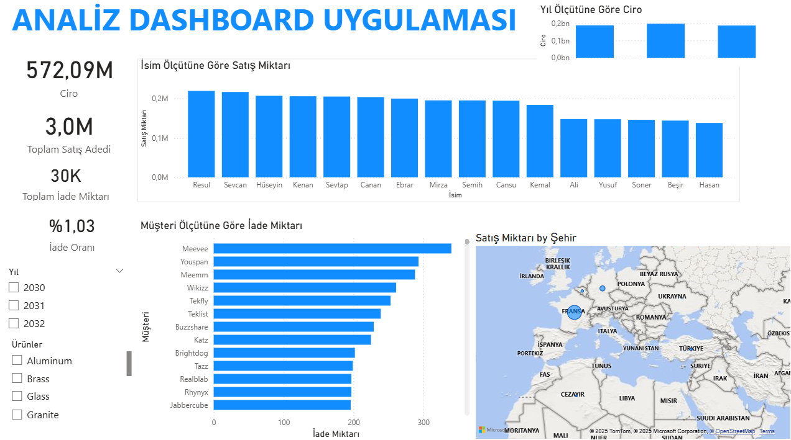

### 1. Analysis Dashboard Uygulaması
Genel satış performansının, iade oranlarının ve bölgesel dağılımın incelendiği stratejik yönetim paneli.

**🎯 İş Problemi:**
Şirketin genel satış trendlerini ve müşteri davranışlarını tek bir ekranda izleyerek, iade oranlarının yüksek olduğu ürün/müşteri gruıplarını tespit etmek.

**🛠️ Kullanılan Teknikler:**
* **DAX & Measures:** Toplam Ciro, İade Miktarı ve İade Oranı (%) hesaplamaları 'SUM' ve 'DIVIDE' fonksiyonları ile dinamik hale getirildi.
* **Coğrafi Analiz:** Satışların yoğunlaştığı bölgeler harita görselleştirmesi ile analiz edildi.
* **Görsel Hiyerarşi:** KPI kartları en üste konumlandırılarak "Büyük Resim" (Big Picture) anında sunuldu.

