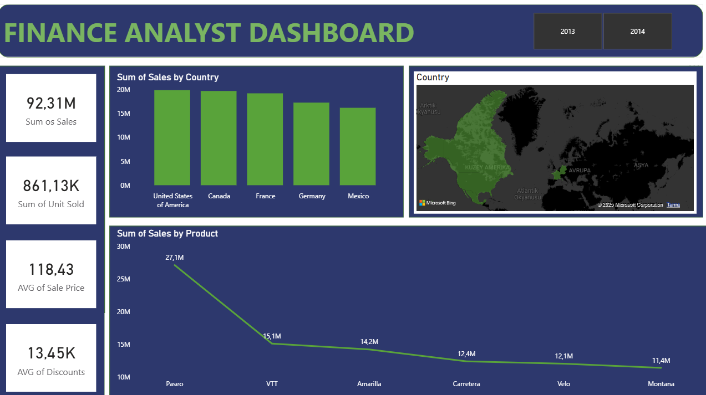

### 2. Finance Analyst Dashboard
A reporting dashboard analyzing the company’s financial health, profitability, and discount strategies.

🎯 Business Problem: To measure how much profit each country and product generates and analyze the impact of discounts on sales.

🛠️ Techniques Used:

- **DAX:** Average sales price calculated with `AVERAGE` and total revenue with `SUM`.  
- **Pareto Analysis Logic:** Trend analysis of top revenue-generating products using line charts.  
- **Geographical Visualization:** Country-based sales performance displayed on a map.

