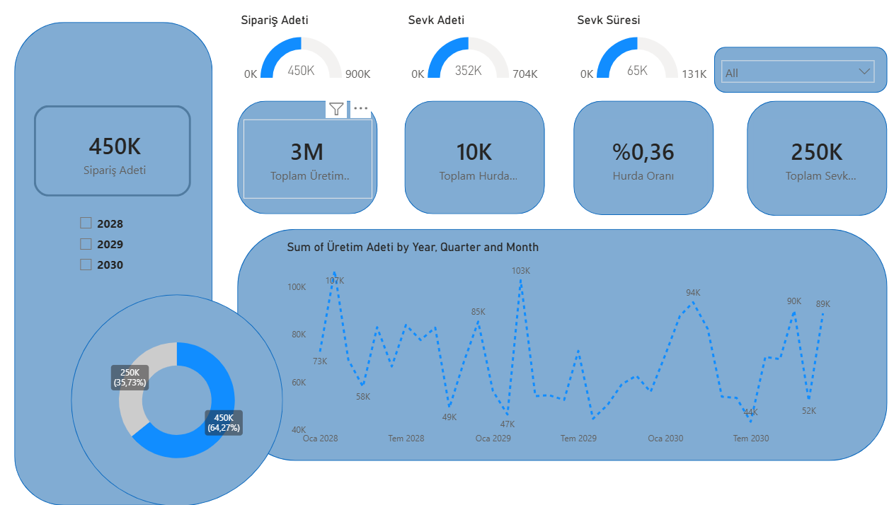

###  Production & Logistics Analysis Dashboard
Fabrika üretim verimliliği, hurda oranları ve lojistik süreçlerinin takibi için tasarlanmış operasyonel yönetim paneli.

**🎯 İş Problemi:**
Üretim adetleri ile hurda miktarları arasındaki ilişkiyi analiz etmek ve sevk sürelerindeki darboğazları tespit ederek OEE (Genel Ekipman Etkinliği) artışına katkı sağlamak.

**🛠️ Kullanılan Teknikler:**
* **DAX & KPI:** Hurda Oranı (%) ve Sevk Süresi gibi kritik üretim metrikleri 'DIVIDE' ve 'AVERAGE' fonksiyonları ile hesaplandı.
* **Trend Analizi:** Üretim adetlerinin dönemsel değişimi (Yıl/Çeyrek/Ay) çizgi grafikleriyle görselleştirildi.
* **Gauge Charts (Kadranlar):** Hedef ve gerçekleşen (Target vs Actual) durum takibi için kadran görselleri kullanıldı.

