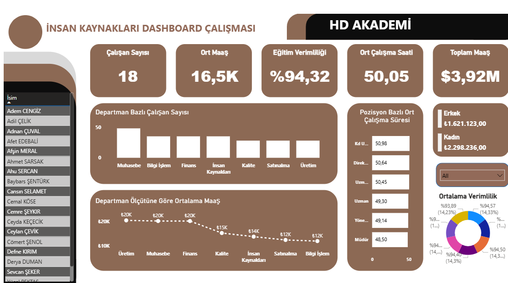

### HR Analytics Dashboard (Human Resources)
An analysis of employee performance, salary distribution, and demographic structure.

🎯 Business Problem: To identify employee productivity, training success rates, and salary imbalances across departments to guide HR strategies.

🛠️ Techniques Used:

- **DAX:** Employee count calculated using `DISTINCTCOUNT`.  
- **UI/UX Design:** A modern and corporate interface was created using a custom "Image Background" instead of standard Power BI themes.  
- **KPI Focus:** Key metrics such as Training Efficiency and Average Working Hours were highlighted.

