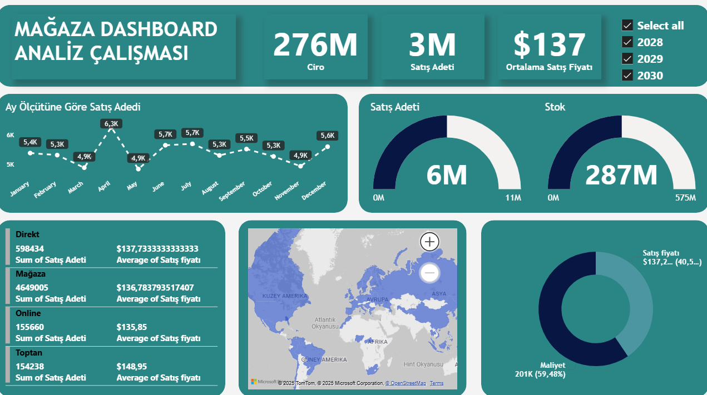

### Store Analysis Dashboard (Retail Analysis)
An operational dashboard analyzing retail store sales performance, stock levels, and cost structure.

🎯 Business Problem: To monitor real-time stock levels and sales quantities, identify high-cost product groups, and optimize inventory management.

🛠️ Techniques Used:

- **Channel Analysis:** Performance of Direct, Store, Online, and Wholesale channels converted into separate metrics.  
- **Visualization:** Gauge charts used for stock and sales targets; donut charts for cost distribution.  
- **DAX:** Average Sales Price calculated using `AVERAGE` for reliable ratio analysis.

