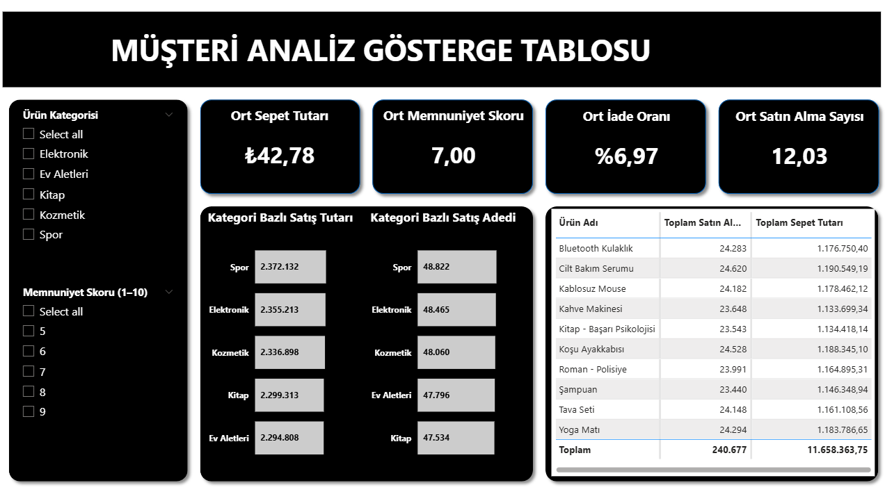

### Customer Analysis Dashboard
A detailed customer analytics dashboard focusing on e-commerce segmentation, loyalty, and satisfaction scores.

🎯 Business Problem: To measure customer loyalty, analyze root causes of return rates (category-based), and develop strategies to increase Average Order Value (AOV).

🛠️ Techniques Used:

- **Advanced DAX:** Calculations performed using `AVERAGE`.  
- **Ratio Analysis:** Return Rates and Purchase Frequency dynamically calculated using `AVERAGE`.  
- **UI Design:** A high-contrast, focused report design implemented using a Dark Mode concept.

