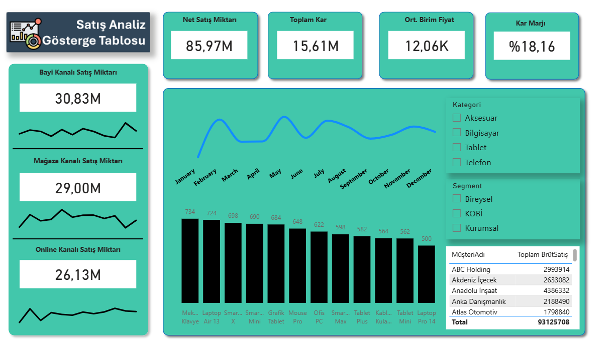

### Sales Analysis Dashboard
A management summary dashboard including overall sales trends, channel performance, and profit margin analysis.

🎯 Business Problem: To compare Dealer, Store, and Online channels to identify the most profitable one and track seasonal sales fluctuations.

🛠️ Techniques Used:

- **Channel Analysis:** Revenue contribution of each channel calculated using `CALCULATE`.  
- **Financial KPIs:** Net Profit Margin (%) and Average Unit Price dynamically calculated using `DIVIDE` and `AVERAGE`.  
- **Visualization:** A custom header image was used to create a corporate-style interface.

