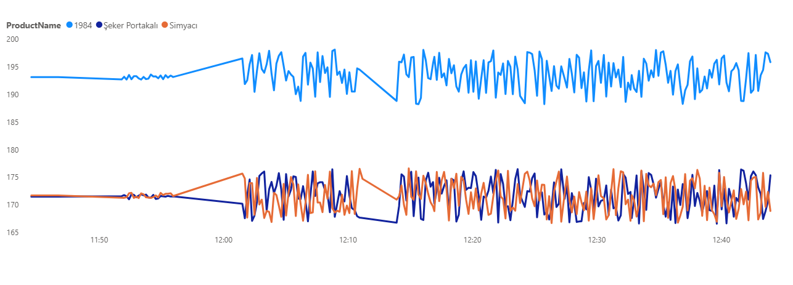

### E-Commerce Price Tracking Pipeline (Real-Time Price Monitoring System) 🚀
An automation project providing competitor price analysis using Python (Web Scraping), SQL, and Power BI integration.

🎯 Business Problem: To track product prices on e-commerce websites (e.g., Kitapyurdu) in real-time, log price changes in a database, and create a live dashboard for competitive advantage.

🛠️ Architecture & Technologies:

- **Python (Scraping & ETL):** Data scraped using `BeautifulSoup` and `Requests`, with User-Agent rotation to bypass anti-bot mechanisms.  
- **Data Simulation:** Micro-simulation (jitter) applied to test data flow and dashboard responsiveness.  
- **SQL Server:** Optimized database schema using `NVARCHAR` and `DECIMAL` data types.  
- **Power BI:** Real-time data visualization using DirectQuery.

