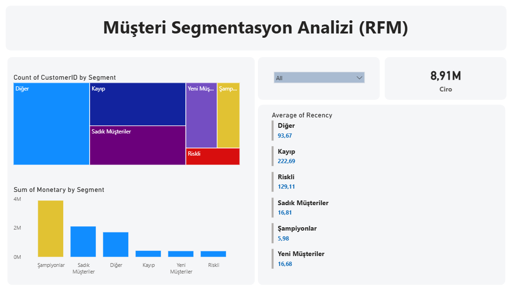

### 9. Customer Segmentation Analysis (RFM) 🎯
E-ticaret müşterilerinin alışveriş alışkanlıklarına göre segmentlere ayrıldığı stratejik pazarlama analizi.

**🎯 İş Problemi:**
Müşteri tabanını daha iyi tanımak, "Kayıp" veya "Riskli" müşterileri tespit etmek ve sadık müşterilere özel stratejiler geliştirmek için RFM (Recency, Frequency, Monetary) skorlaması yapmak.

**🛠️ Kullanılan Teknikler:**
* **Data Engineering (SQL):** Ham veriden RFM metrikleri hesaplandı ve 'NTILE' pencere fonksiyonu (Window Function) ile müşteriler 1-5 arası puanlandı.
* **Segmentation Logic:** SQL tarafında 'CASE WHEN' yapısı ile puanlar birleştirilerek "Şampiyonlar", "Sadık Müşteriler", "Riskli" gibi dinamik segmentler oluşturuldu.
* **Görselleştirme:** Segment büyüklüklerini analiz etmek için **Treemap** ve ciro katkılarını görmek için **Bar Chart** kullanıldı.

