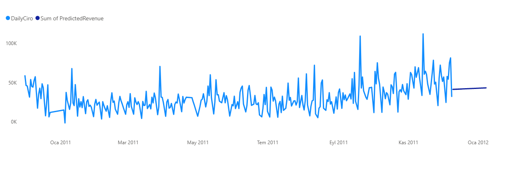

### Sales Forecasting with Machine Learning 🤖
A machine learning project predicting future revenue trends using historical sales data.

🎯 Business Problem: To identify the underlying growth trend by removing noise from daily sales data and generate a 30-day revenue forecast.

🛠️ Techniques Used:

- **Python (Scikit-Learn):** Trend analysis performed using the `LinearRegression` algorithm.  
- **Feature Engineering:** Date data transformed into ordinal numerical format for model compatibility.  
- **SQL & Power BI Integration:** Forecast data written back to SQL and visualized alongside historical data in Power BI.

