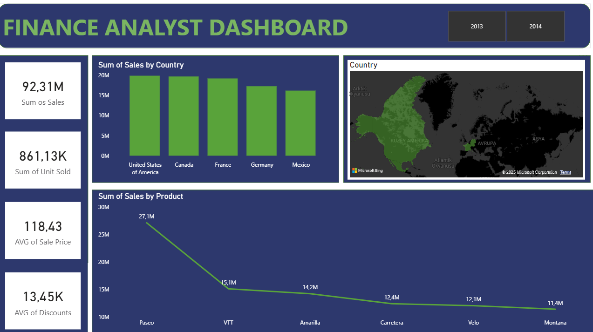

# 📊 Power BI Portfolio Projects

Bu repo, veri görselleştirme ve iş zekası yetkinliklerimi sergilemek amacıyla hazırladığım **Power BI** projelerini içerir.

Projelerde veri modelleme (Star Schema), veri temizleme (Power Query) ve görselleştirme teknikleri kullanılmıştır.

## 💡 DAX Yaklaşımı ve Teknik Metodoloji (Önemli Not)

Bu projelerdeki hesaplamaların bir kısmında **"Explicit Measures" (Açık Ölçüler)** yöntemi tercih edilmiştir.

Power BI'ın sunduğu sürükle-bırak (Implicit Measures) kolaylığı yerine; en temel toplama (SUM), sayma (COUNT) ve ortalama işlemlerinde dahi **DAX (Data Analysis Expressions)** fonksiyonları manuel olarak yazılmıştır.

**Bunun Amacı:**
* **Best Practice:** Endüstri standartlarına uygun, sürdürülebilir ve hatasız raporlar oluşturmak.
* **DAX Hakimiyeti:** 'CALCULATE', 'DIVIDE', 'SUMX' ve 'Time Intelligence' fonksiyonlarında yetkinlik kazanmak.
* **Performans ve Kontrol:** Hesaplamalar üzerinde tam kontrol sağlayarak, filtre bağlamlarını (Filter Context) doğru yönetmek.

---

## 📂 Proje Detayları

### 1. Analysis Dashboard Uygulaması
Genel satış performansının, iade oranlarının ve bölgesel dağılımın incelendiği stratejik yönetim paneli.

**🎯 İş Problemi:**
Şirketin genel satış trendlerini ve müşteri davranışlarını tek bir ekranda izleyerek, iade oranlarının yüksek olduğu ürün/müşteri gruıplarını tespit etmek.

**🛠️ Kullanılan Teknikler:**
* **DAX & Measures:** Toplam Ciro, İade Miktarı ve İade Oranı (%) hesaplamaları 'SUM' ve 'DIVIDE' fonksiyonları ile dinamik hale getirildi.
* **Coğrafi Analiz:** Satışların yoğunlaştığı bölgeler harita görselleştirmesi ile analiz edildi.
* **Görsel Hiyerarşi:** KPI kartları en üste konumlandırılarak "Büyük Resim" (Big Picture) anında sunuldu.

---

### 2. Finance Analyst Dashboard
Şirketin finansal sağlığını, karlılığını ve indirim stratejilerini inceleyen raporlama çalışması.

**🎯 İş Problemi:**
Hangi ülkenin ve hangi ürünün şirkete ne kadar kar getirdiğini ve indirimlerin satışlara etkisini ölçümlemek.

**🛠️ Kullanılan Teknikler:**
* **DAX:** 'AVERAGE' ile ortalama satış fiyatı ve 'SUM' ile toplam ciro hesaplamaları.
* **Pareto Analizi Mantığı:** En çok ciro getiren ürünlerin (Top Products) çizgi grafiği ile trend analizi.
* **Coğrafi Görselleştirme:** Ülke bazlı satış performansının harita üzerinde gösterimi.

---

### 3. Production & Logistics Analysis Dashboard
Fabrika üretim verimliliği, hurda oranları ve lojistik süreçlerinin takibi için tasarlanmış operasyonel yönetim paneli.

**🎯 İş Problemi:**
Üretim adetleri ile hurda miktarları arasındaki ilişkiyi analiz etmek ve sevk sürelerindeki darboğazları tespit ederek OEE (Genel Ekipman Etkinliği) artışına katkı sağlamak.

**🛠️ Kullanılan Teknikler:**
* **DAX & KPI:** Hurda Oranı (%) ve Sevk Süresi gibi kritik üretim metrikleri 'DIVIDE' ve 'AVERAGE' fonksiyonları ile hesaplandı.
* **Trend Analizi:** Üretim adetlerinin dönemsel değişimi (Yıl/Çeyrek/Ay) çizgi grafikleriyle görselleştirildi.
* **Gauge Charts (Kadranlar):** Hedef ve gerçekleşen (Target vs Actual) durum takibi için kadran görselleri kullanıldı.

---

### 4. HR Analytics Dashboard (İnsan Kaynakları)
Şirket çalışanlarının performansı, maaş dağılımı ve demografik yapısının analizi.

**🎯 İş Problemi:**
Personel verimliliğini, eğitim başarı oranlarını ve departman bazlı maaş dengesizliklerini tespit ederek İK stratejilerine yön vermek.

**🛠️ Kullanılan Teknikler:**
* **DAX:** 'DISTINCTCOUNT' ile çalışan sayısı hesaplandı.
* **UI/UX Tasarımı:** Standart Power BI temaları yerine, özel olarak tasarlanmış **"Custom Image Background" (Resim Arka Plan)** tekniği kullanılarak modern ve kurumsal bir arayüz oluşturuldu.
* **KPI Odaklılık:** Eğitim Verimliliği ve Ortalama Çalışma Saati gibi kritik metrikler ön plana çıkarıldı.

---

### 5. Store Analysis Dashboard (Mağaza Analizi)
Perakende mağazalarının satış performansını, stok seviyelerini ve maliyet yapısını inceleyen operasyonel analiz paneli.

**🎯 İş Problemi:**
Mağazaların anlık stok durumunu ve satış adetlerini izleyerek, yüksek maliyetli ürün gruplarını tespit etmek ve stok optimizasyonu sağlamak.

**🛠️ Kullanılan Teknikler:**
* **Kanal Analizi:** Direkt, Mağaza, Online ve Toptan satış kanallarının performansları ayrı ayrı metriklere dönüştürüldü.
* **Görselleştirme:** Stok ve Satış Adedi hedeflerini izlemek için **"Gauge Chart" (Kadran Grafiği)** ve maliyet dağılımı için **"Donut Chart"** kullanıldı.
* **DAX:** Ortalama Satış Fiyatı hesaplamasında 'AVERAGE' kullanılarak güvenli oran analizi yapıldı.

---

### 6. Customer Analysis Dashboard (Müşteri Analizi)
E-ticaret müşteri segmentasyonu, sadakat analizi ve memnuniyet skorlarını inceleyen detaylı müşteri paneli.

**🎯 İş Problemi:**
Müşteri sadakatini ölçümlemek, iade oranlarının kök nedenlerini (kategori bazlı) analiz etmek ve Ortalama Sepet Tutarını (AOV) artıracak stratejiler geliştirmek.

**🛠️ Kullanılan Teknikler:**
* **Gelişmiş DAX:** 'AVERAGE' fonksiyonu ile hesaplamalar yapıldı.
* **Oran Analizi:** İade Oranları ve Satın Alma Sıklığı (Frequency) metrikleri 'AVERAGE' fonksiyonu ile dinamikleştirildi.
* **UI Tasarımı:** 'Dark Mode' (Karanlık Mod) konsepti ile yüksek kontrastlı ve odaklayıcı bir rapor tasarımı uygulandı.

---

### 7. Sales Analysis Gösterge Tablosu
Genel satış trendleri, kanal performansları ve kar marjı analizini içeren yönetim özeti.

**🎯 İş Problemi:**
Bayi, Mağaza ve Online kanallarının performansını kıyaslayarak en karlı satış kanalını belirlemek ve mevsimsel satış dalgalanmalarını takip etmek.

**🛠️ Kullanılan Teknikler:**
* **Kanal Analizi:** 'CALCULATE' fonksiyonu ile her bir satış kanalının (Bayi, Mağaza, Online) ciro katkısı ayrı ayrı hesaplandı.
* **Finansal KPI'lar:** Net Kar Marjı (%) ve Ortalama Birim Fiyat gibi finansal metrikler 'DIVIDE' ve 'AVERAGE' ile dinamikleştirildi.
* **Görselleştirme:** Özel tasarım başlık görseli (Custom Header Image) kullanılarak kurumsal kimliğe uygun bir arayüz oluşturuldu.

---
*Projelerin detaylı `.pbix` dosyalarını ilgili klasörlerin içinde bulabilirsiniz.*
